# 🚀 Flutter BLoC CRUD with Clean Architecture

<div align="center">


**A robust, production-ready Flutter application demonstrating full CRUD operations with Clean Architecture**

[📱 Live Demo](#-screenshots) • [🏗️ Architecture](#️-architecture) • [🚀 Getting Started](#-getting-started) • [🤝 Contributing](#-contributing)

</div>

---

## 📖 Overview

This project serves as a **comprehensive template** for building scalable and maintainable Flutter applications. It demonstrates professional software development practices with a focus on clean code, separation of concerns, and modern Flutter development patterns.

> 💡 **Perfect for**: Learning Clean Architecture, BLoC pattern implementation, and REST API integration in Flutter

## ✨ Features

| Feature | Description |
|---------|-------------|
| 🔄 **Full CRUD Operations** | Create, Read, Update, and Delete posts seamlessly |
| 🎯 **State Management** | Predictable and scalable state management using `flutter_bloc` |
| 🏗️ **Clean Architecture** | Clear separation between Data, Domain, and Presentation layers |
| 🌐 **REST API Integration** | Efficient network communication with `dio` package |
| 💉 **Dependency Injection** | Decoupled and highly testable code structure |
| ⚡ **Optimistic UI** | Instant UI updates for better user experience |
| 🛡️ **Error Handling** | Graceful error handling and user feedback |
| 📱 **Responsive Design** | Works seamlessly across different screen sizes |

## 🏗️ Architecture
This project follows the principles of **Clean Architecture** to create a separation of concerns, making the codebase easier to test, maintain, and scale.

```mermaid
graph TB
    UI[🎨 Presentation Layer] --> BL[🧠 Domain Layer]
    BL --> DL[💾 Data Layer]
    
    subgraph "🎨 Presentation Layer"
        W[Widgets/Screens]
        B[BLoC Components]
    end
    
    subgraph "🧠 Domain Layer"
        R[Repository Contracts]
        E[Entities/Models]
    end
    
    subgraph "💾 Data Layer"
        API[API Services]
        M[Data Models]
    end
```

<div align="center">



</div>

### 📂 Project Structure

The application is divided into **three main layers**:

#### 🎨 **Presentation Layer**
- **Purpose**: Contains UI components and business logic components
- **Components**: Screens, Widgets, and BLoC (Business Logic Component)
- **Responsibility**: Dispatches events to BLoC and listens for state changes
- **Independence**: Knows nothing about data sources

#### 🧠 **Domain Layer** 
- **Purpose**: The core of the application containing business logic
- **Components**: Abstract repository contracts and entities
- **Responsibility**: Defines what the app can do
- **Independence**: Completely independent of other layers

#### 💾 **Data Layer**
- **Purpose**: Handles all data operations and external communications
- **Components**: API services, data models, and repository implementations
- **Responsibility**: Implements contracts defined in Domain layer
- **Independence**: Can be easily swapped or modified

```
📁 lib/
├── 💾 data/
│   ├── 📋 models/         # Data models (e.g., Post)
│   └── 🌐 services/       # API service implementation
│
├── 🧠 domain/
│   └── 📜 repositories/   # Abstract repository contracts
│
└── 🎨 presentation/
    ├── 🎯 bloc/           # BLoC files (Events, States, BLoCs)
    └── 🖼️ ui/             # UI Widgets and Screens
        ├── 📱 screens/    # Application screens
        └── 🧩 widgets/    # Reusable UI components
```

## 📱 Screenshots

<div align="center">

### � **App in Action**

| 🏠 Home Screen | ➕ Add Post | ✏️ Update Post | 🗑️ Delete Post |
|----------------|-------------|---------------|---------------|
|  |  |  |  |
| **Main dashboard with all posts** | **Create new posts easily** | **Edit existing posts** | **Confirm before deletion** |

</div>

### 🛠️ API Configuration

<div align="center">

| 🌐 API Endpoint Setup | 📋 MockAPI Schema |
|----------------------|-------------------|
|  |  |
| **Your custom MockAPI endpoint configuration** | **Data structure for posts resource** |

</div>

## 🚀 Getting Started
Follow these instructions to get a copy of the project up and running on your local machine for development and testing purposes.

### 📋 Prerequisites

Before you begin, ensure you have the following installed:

-  **Flutter SDK** (version 3.x.x or higher)
-  **IDE** like Android Studio or VS Code
-  **Git** for version control

### 🛠️ Setup and Installation

#### **Step 1: Set up your own MockAPI.io Endpoint**

> ⚠️ **Important**: This project requires a custom API endpoint to function. The original endpoint is temporary.

<details>
<summary>🔧 <strong>Click to expand setup instructions</strong></summary>

1. **Create Account**: Go to [MockAPI.io](https://mockapi.io) and sign in with your  account
2. **New Project**: Create a New Project 
3. **Add Resource**: Add a New Resource and name it `posts`
4. **Define Schema**: Set up the following fields:
   ```json
   {
     "title": "String (Sentence)",
     "body": "String (Paragraphs)"
   }
   ```
5. **Save & Copy**: Save the schema and copy your unique API endpoint URL

</details>

#### **Step 2: Configure the Project**

```bash
# 📥 Clone the repository
git clone https://github.com/<your-github-username>/<your-repo-name>.git

# 📂 Navigate to project directory  
cd <your-repo-name>
```

#### **Step 3: Update API Configuration**

1. Open `lib/data/services/post_api_service.dart`
2. Find the `_baseUrl` variable
3. Replace with your MockAPI endpoint:

```dart
final String _baseUrl = 'https://<your-unique-string>.mockapi.io/api/v1/posts';
```

#### **Step 4: Install Dependencies & Run**

```bash
# 📦 Install dependencies
flutter pub get

# 🚀 Run the application
flutter run
```

### 🎯 Quick Start Commands

| Command | Description |
|---------|-------------|
| `flutter pub get` | Install dependencies |
| `flutter run` | Run on connected device |
| `flutter build apk` | Build APK for Android |
| `flutter test` | Run unit tests |
| `flutter analyze` | Analyze code quality |

## 🛠️ Tech Stack & Packages
| Technology | Package | Version | Purpose |
|------------|---------|---------|---------|
|  | `flutter` | SDK | UI toolkit for building the application |
|  | `dart` | ^3.8.1 | Programming language |
| 🎯 | `flutter_bloc` | ^9.1.1 | Predictable state management |
| 🌐 | `dio` | ^5.8.0+1 | Powerful HTTP client for network requests |
| ⚖️ | `equatable` | ^2.0.7 | Object comparison and BLoC optimization |
| 📅 | `intl` | ^0.19.0 | Internationalization and date formatting |
| 🎨 | `cupertino_icons` | ^1.0.8 | iOS-style icons |

### 🧪 Development Dependencies

| Package | Version | Purpose |
|---------|---------|---------|
| `flutter_test` | SDK | Testing framework for Flutter apps |
| `flutter_lints` | ^5.0.0 | Dart code linting and analysis |

### 📊 Performance Features

- **🚀 Fast**: Optimized for 60fps performance
- **📱 Responsive**: Adaptive UI for different screen sizes  
- **🔄 Efficient**: Smart state management with minimal rebuilds
- **⚡ Quick**: Instant feedback with optimistic updates

## 🤝 Contributing

<div align="center">

**Contributions are what make the open-source community such an amazing place to learn, inspire, and create!**

[](https://github.com/The-Black-Shadow/restapi_crud/graphs/contributors)
[](https://github.com/The-Black-Shadow/restapi_crud/network/members)
[](https://github.com/The-Black-Shadow/restapi_crud/stargazers)
[](https://github.com/yourusername/restapi_crud/issues)

</div>

### 🌟 How to Contribute

1. **🍴 Fork** the Project
2. **🌿 Create** your Feature Branch 
   ```bash
   git checkout -b feature/AmazingFeature
   ```
3. **💾 Commit** your Changes 
   ```bash
   git commit -m 'Add some AmazingFeature'
   ```
4. **🚀 Push** to the Branch 
   ```bash
   git push origin feature/AmazingFeature
   ```
5. **🔄 Open** a Pull Request

### 📝 Contribution Guidelines

- Follow the existing code style and conventions
- Write clear commit messages
- Add tests for new features
- Update documentation as needed
- Be respectful and constructive in discussions

## 📄 License

<div align="center">

**Distributed under the MIT License**

[](https://opensource.org/licenses/MIT)

See `LICENSE` file for more information.

</div>

---

<div align="center">

**⭐ Star this repo if you found it helpful!**

Made with ❤️ for the Flutter community

[🔝 Back to top](#-flutter-bloc-crud-with-clean-architecture)

</div>